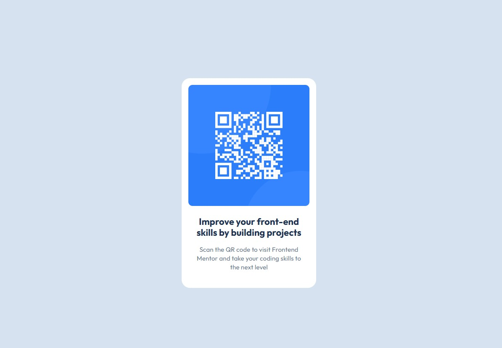

# Frontend Mentor - QR code component solution

## Overview

This challenge was to build and deploy Frontend Mentor's QR code component challenge.  Frontend Mentor provided various assets including the image, figma file, and style guide.

[Frontend Mentor QR code component challenge](https://www.frontendmentor.io/challenges/qr-code-component-iux_sIO_H)

This was a basic challenge requiring only css and HTML knowledge.

### Screenshot

### Links

- Solution URL: [github repository](https://github.com/ClassPython/fem-qr-code-component)
- Live Site URL: [github-pages]( https://classpython.github.io/fem-qr-code-component/)

### Built with

- Semantic HTML5 markup
- CSS properties
- Flexbox

### What I learned

 Learned basics of Frontend Mentor and utilized Flexbox to center component.

 

